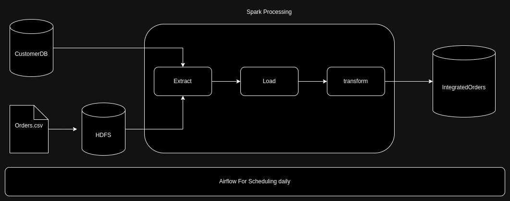
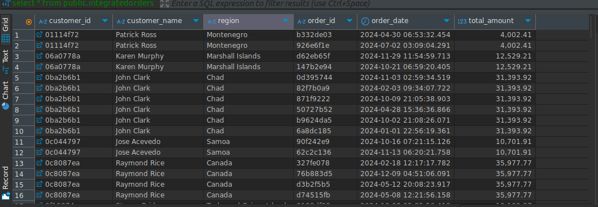
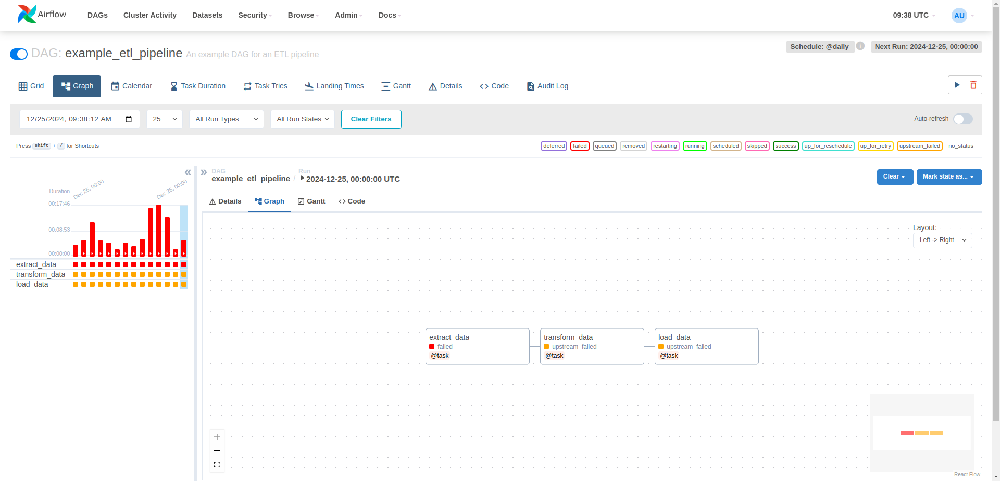

## Pipeline Workflow

- **Extract**:
  - Connect to `CustomerDB` and pull the required customer data.
  - Load the `Orders.csv` from HDFS.
  
- **Transform**:
  - Use Apache Spark for processing:
    - Combine the customer data and order data.
    - Apply transformations: 
        - Convert datetime formats to YYYY-MM-DD.
        - Calculate the total order amount.
  
- **Load**:
  - Save the final integrated data into the `IntegratedOrders` database for reporting and analytics.
  
- **Scheduling**:
  - Airflow triggers this pipeline once daily.

## Prerequisites

1. **Apache Spark**:
   - Ensure that Spark is correctly installed and configured.
   
2. **Airflow**:
   - Airflow should be set up for task scheduling and workflow orchestration.
   - Set up a daily schedule to trigger the pipeline.
   
3. **Hadoop (HDFS)**:
   - The `Orders.csv` file should be present in the Hadoop Distributed File System (HDFS).

4. **Database Connection**:
   - Ensure that the `CustomerDB` and `IntegratedOrders` databases are accessible.
   
## Requirements

- Apache Spark 3.0+
- Airflow 2.0+
- Hadoop 3.0+ (for HDFS)
- Python 3.x
- PySpark

The pipeline is scheduled to run every hour and the data is processed and stored in the data lake.

## DEPLOYMENT

I have tested the pipeline in local and the etl have worked fine. However, I have still some bugs in docker environments.

Some Images of the pipeline:

